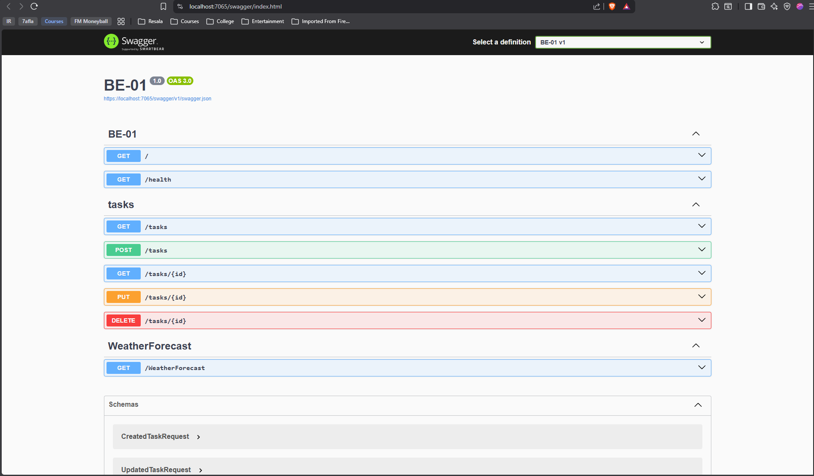

# To Do List API

A small CRUD API for managing a to-do list, built with ASP.NET Core.

## How to run

1. Clone this repo
2. Run: `dotnet run`
3. The API will be available at `http://localhost:7065`
4. Swagger UI: `http://localhost:7065/swagger`

## Endpoints

| Method | Route          | Description             |
|--------|----------------|--------------------------|
| GET    | `/`            | API info                |
| GET    | `/health`      | Health check             |
| GET    | `/tasks`       | List all tasks           |
| GET    | `/tasks/{id}`  | Get one task              |
| POST   | `/tasks`       | Create a task             |
| PUT    | `/tasks/{id}`  | Update a task             |
| DELETE | `/tasks/{id}`  | Delete a task             |

## Example request

​```
curl -i -k -X POST https://localhost:7065/tasks -H "Content-Type: application/json" -d "{""title"":""Complete Assignment""}"
​```

```
HTTP/1.1 201 Created
Content-Type: application/json; charset=utf-8
Date: Tue, 21 Jul 2026 10:07:05 GMT
Server: Kestrel
Location: https://localhost:7065/tasks/4
Transfer-Encoding: chunked

{"id":4,"title":"Complete Assignment","done":false}
```

## Swagger UI

