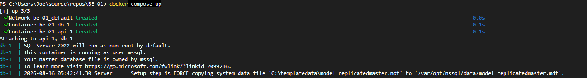
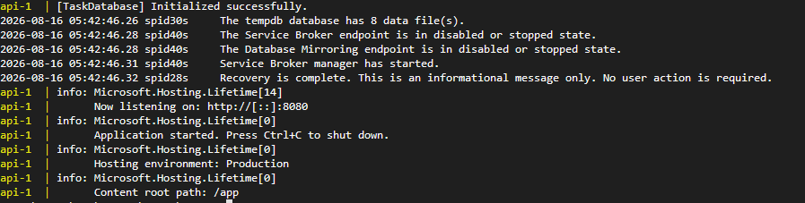
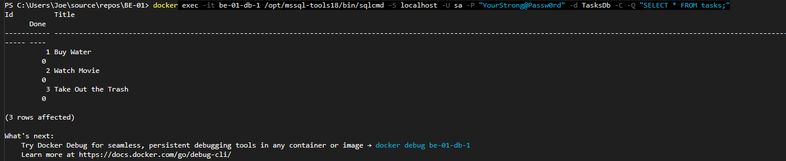

# To Do List API

A small CRUD API for managing a to-do list, built with ASP.NET Core, running against a containerized SQL Server database.

## Storage

This project uses **SQL Server**, running in Docker — not PostgreSQL. The assignment permits any SQL database, provided containerization is still used (confirmed with instructors on the course Q&A board — see note below). SQL Server was chosen since I already had prior experience with it from earlier assignments in this repo.

The entire stack — API and database — runs via Docker Compose. No manual installation of SQL Server or .NET is required on the host machine; only Docker.

## How to run

1. Clone this repo
2. Copy `.env.example` to `.env` and set your own password:
   ```
   cp .env.example .env
   ```
3. Run:
   ```
   docker compose up
   ```
4. The database and `tasks` table are created automatically on first run, seeded with 3 example tasks
5. The API will be available at `http://localhost:8080`
6. Swagger UI: `http://localhost:8080/swagger`

No local installation of .NET or SQL Server is required — only Docker Desktop.

## Endpoints

| Method | Route          | Description             |
|--------|----------------|--------------------------|
| GET    | `/`            | API info                |
| GET    | `/health`      | Health check             |
| GET    | `/tasks`       | List all tasks           |
| GET    | `/tasks/{id}`  | Get one task              |
| POST   | `/tasks`       | Create a task             |
| PUT    | `/tasks/{id}`  | Update a task             |
| DELETE | `/tasks/{id}`  | Delete a task             |

All CRUD operations use parameterized SQL queries — no user input is concatenated into SQL strings.

## Example request

```
curl -i http://localhost:8080/tasks
```

```
HTTP/1.1 200 OK
Content-Type: application/json; charset=utf-8

[
  {"id":1,"title":"Buy Milk","done":false},
  {"id":2,"title":"Watch Movie","done":false},
  {"id":3,"title":"Take Out the Trash","done":false}
]
```

## Persistence

Data survives both a single container restart and a full stack teardown (`docker compose down` followed by `docker compose up`), since it's stored in a named Docker volume (`taskdata`) mounted into the SQL Server container — independent of the containers' own lifecycle.

Verified by creating tasks, running `docker compose down` then `docker compose up`, and confirming the same tasks are still returned by `GET /tasks`.

## Database engine choice

The assignment's default guidance was PostgreSQL, but instructors confirmed on the course Q&A board that any SQL database is acceptable, provided the containerization requirements (Docker, Docker Compose, one-command startup, `.env`-based secrets) are still met. This project uses SQL Server for that reason, reusing storage patterns already built in an earlier assignment in this same repo (A2 — connecting the CRUD API to a database), while implementing the full container + Compose workflow from scratch for this assignment.

## Architecture

- **Dockerfile** — a multi-stage build: the first stage compiles the app using the full .NET SDK image; the second copies only the published output into a lean ASP.NET runtime image.
- **compose.yaml** — defines two services:
  - `api` — the ASP.NET Core application, built from the Dockerfile
  - `db` — the official Microsoft SQL Server image, with a named volume for persistence
- Inside the Compose network, the API reaches the database using the service name `db` (not `localhost`), since each container has its own isolated network namespace.
- All secrets (the SA password, the connection string) are read from a git-ignored `.env` file — never hardcoded. A committed `.env.example` documents the required keys with placeholder values.
- On startup, the API includes retry logic when connecting to the database, since SQL Server's container can report as "started" slightly before it's actually ready to accept logins on a fresh volume.

## Screenshots







## Clean-clone verification

Tested by running:
```
docker compose down -v
docker compose up
```
The `-v` flag removes the named volume as well, simulating a completely fresh clone with no prior data. The database, table, and three seed tasks were all recreated automatically, with no manual setup steps beyond `docker compose up`.