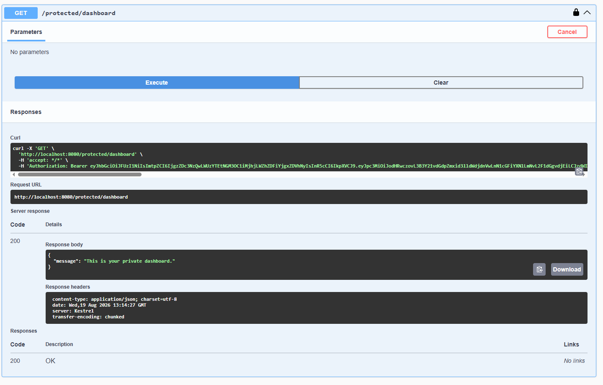

# To Do List API

A CRUD API for managing a to-do list, built with ASP.NET Core, running against a containerized SQL Server database, with authentication handled by Supabase Auth.

## Storage

This project uses **SQL Server**, running in Docker — not PostgreSQL. The assignment permits any SQL database, provided containerization is still used (confirmed with instructors on the course Q&A board). SQL Server was chosen since I already had prior experience with it from earlier assignments in this repo.

The entire stack — API and database — runs via Docker Compose. No manual installation of SQL Server or .NET is required on the host machine; only Docker.

## Authentication

User accounts, password hashing, and JSON Web Token (JWT) issuance are handled entirely by **Supabase Auth**. This project never stores a password or performs any cryptography itself — it forwards credentials to Supabase and verifies the tokens Supabase issues.

- **Sign up / Log in**: the client sends an email and password directly to this API, which forwards them to Supabase and returns whatever Supabase responds with (including the access token).
- **Verification**: protected routes are guarded by a custom ASP.NET Core authentication handler (`SupabaseAuthHandler`). On every request to a protected route, the handler extracts the bearer token from the `Authorization` header and calls Supabase's `/auth/v1/user` endpoint to confirm the token is genuinely valid — not just correctly shaped. Tampered or expired tokens are rejected with `401`.
- **Reuse**: the verification logic lives in exactly one place. Any route can be protected simply by adding `[Authorize(AuthenticationSchemes = "Supabase")]` — no route-specific auth code is duplicated.

## How to run

1. Clone this repo
2. Create a free project at [supabase.com](https://supabase.com)
3. In your Supabase project, go to **Project Settings → API** and copy your **Project URL** and **anon key**
4. In **Authentication → Providers → Email** (or **Authentication → Settings**, depending on your Supabase dashboard version), turn off **"Confirm email"** so newly signed-up test users can log in immediately without clicking an email link
5. Copy `.env.example` to `.env` and fill in your own values:
   ```
   cp .env.example .env
   ```
6. Run:
   ```
   docker compose up
   ```
7. The database and `tasks` table are created automatically on first run, seeded with 3 example tasks
8. The API will be available at `http://localhost:8080`
9. Swagger UI: `http://localhost:8080/swagger`

No local installation of .NET, SQL Server, or any Supabase SDK is required — only Docker Desktop and a free Supabase account.

## Endpoints

| Method | Route                  | Description                          | Auth required |
|--------|------------------------|---------------------------------------|----------------|
| GET    | `/`                    | API info                              | No             |
| GET    | `/health`              | Health check                          | No             |
| GET    | `/public/info`         | Public, open data                     | No             |
| POST   | `/auth/signup`         | Create a new user account             | No             |
| POST   | `/auth/login`          | Authenticate & return a JWT           | No             |
| POST   | `/auth/logout`         | End the user's session                | Yes (Bearer)   |
| GET    | `/protected/profile`   | Read private profile data             | Yes (Bearer)   |
| GET    | `/protected/dashboard` | Example second protected route        | Yes (Bearer)   |
| GET    | `/tasks`               | List all tasks                        | No             |
| GET    | `/tasks/{id}`          | Get one task                          | No             |
| POST   | `/tasks`               | Create a task                         | No             |
| PUT    | `/tasks/{id}`          | Update a task                         | No             |
| DELETE | `/tasks/{id}`          | Delete a task                         | No             |

All database operations use parameterized SQL queries — no user input is concatenated into SQL strings. Task endpoints are not currently gated behind authentication; only the `/auth/logout` and `/protected/*` routes require a valid bearer token.

## Example requests

**Sign up:**
```
curl -i -X POST http://localhost:8080/auth/signup -H "Content-Type: application/json" -d "{\"email\":\"test@example.com\",\"password\":\"password123\"}"
```
```
HTTP/1.1 201 Created
Content-Type: application/json; charset=utf-8

{"access_token":"eyJhbGci...","token_type":"bearer","expires_in":3600,"refresh_token":"...","user":{"id":"...","email":"test@example.com", ...}}
```

**Accessing a protected route without a token:**
```
curl -i http://localhost:8080/protected/profile
```
```
HTTP/1.1 401 Unauthorized
Content-Type: application/json

{"error":"Access token required"}
```

**Accessing a protected route with a valid token:**
```
curl -i http://localhost:8080/protected/profile -H "Authorization: Bearer <access_token>"
```
```
HTTP/1.1 200 OK
Content-Type: application/json

{"id":"...","email":"test@example.com", ...}
```

## Persistence

Task data survives both a single container restart and a full stack teardown (`docker compose down` followed by `docker compose up`), since it's stored in a named Docker volume (`taskdata`) mounted into the SQL Server container — independent of the containers' own lifecycle.

User accounts are managed entirely by Supabase and are not affected by anything happening in this repo's containers.

## Architecture

- **Dockerfile** — a multi-stage build: the first stage compiles the app using the full .NET SDK image; the second copies only the published output into a lean ASP.NET runtime image.
- **compose.yaml** — defines two services:
  - `api` — the ASP.NET Core application, built from the Dockerfile
  - `db` — the official Microsoft SQL Server image, with a named volume for persistence
- Inside the Compose network, the API reaches the database using the service name `db` (not `localhost`), since each container has its own isolated network namespace.
- Supabase is called directly over HTTPS from `SupabaseAuthService`, using `HttpClient` — no third-party Supabase SDK is used, so every request/response shape is explicit in the code rather than hidden behind a wrapper library.
- Token verification is implemented as a custom `AuthenticationHandler` (`SupabaseAuthHandler`), plugged into ASP.NET Core's built-in authentication pipeline. This allows any route to be protected simply by adding `[Authorize(AuthenticationSchemes = "Supabase")]`, following the same pattern used by ASP.NET Core's built-in auth schemes rather than a hand-rolled middleware function.
- All secrets (Supabase URL/key, the SQL Server SA password, the connection string) are read from a git-ignored `.env` file — never hardcoded. A committed `.env.example` documents the required keys with placeholder values.
- On startup, the API includes retry logic when connecting to the database, since SQL Server's container can report as "started" slightly before it's actually ready to accept logins on a fresh volume.

## Database engine choice

The assignment's default guidance was PostgreSQL, but instructors confirmed on the course Q&A board that any SQL database is acceptable, provided the containerization requirements (Docker, Docker Compose, one-command startup, `.env`-based secrets) are still met. This project uses SQL Server for that reason, reusing storage patterns already built in an earlier assignment in this same repo, while implementing the full container + Compose workflow independently.

## Screenshots




## Clean-clone verification

Tested by running:
```
docker compose down -v
docker compose up --build
```
The `-v` flag removes the named volume as well, simulating a completely fresh clone with no prior data. The database, table, and three seed tasks were all recreated automatically, and the Supabase-backed signup/login/protected-route flow worked immediately, with no manual setup steps beyond `docker compose up` and providing valid `.env` values.